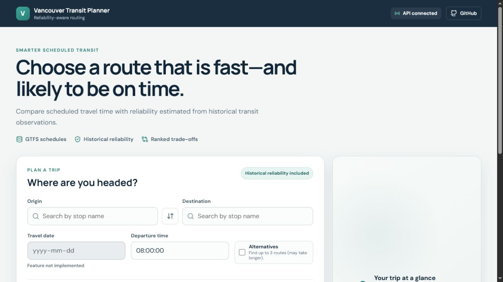
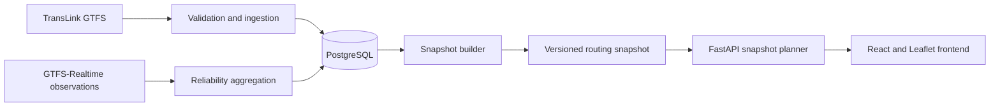

# Vancouver Transit Planner

A reliability-aware journey planner that turns TransLink GTFS schedules and
historical delay observations into ranked transit routes for Metro Vancouver.



There is no public demo URL in the repository. Production deployment is defined
for Render, but URLs and secrets are intentionally supplied by the operator.

## Why this project

Most schedule planners optimize arrival time alone. This project keeps scheduled
travel time visible while also estimating whether the route is likely to perform
reliably. Users can adjust that trade-off, request up to three alternatives, and
inspect each alternative independently on the map.

## Key features

- Stop autocomplete backed by the active routing snapshot.
- Dijkstra and validated A* choices in the public production API.
- Reliability-aware ranking with explicit fallback metadata.
- Optional alternatives, capped at three public results.
- Separate map geometry, markers, colors, and selection for each alternative.
- Explicit timeout, feed-expiration, planner-readiness, and no-route states.
- `/health` process liveness and `/ready` routing readiness.
- PostgreSQL ingestion and reliability aggregation outside request handling.
- Memory-mapped, database-free snapshot routing in production.
- Deterministic backend, frontend, API, randomized differential, and database
  integration tests.

## Technical highlights

- Snapshot artifacts store compact NumPy arrays for stops, connections, service
  calendars, transfers, and reliability profiles.
- Transfer records are indexed by origin stop instead of scanned globally.
- Snapshot A* uses a request-local cached Haversine travel-time heuristic only
  when the snapshot proves a safe maximum spatial-edge speed. Invalid or older
  metadata falls back to zero without invalidating routing.
- Alternative collection stays arrival-ordered, so it deliberately does not use
  geographic A* queue ordering.
- Search deadlines, label limits, and candidate limits produce explicit
  diagnostics or errors instead of silently returning “no routes.”
- GTFS times beyond `24:00:00` remain valid service-day times.
- Reliability profile selection is shared between database and snapshot modes.

## Architecture



PostgreSQL is used for GTFS ingestion, reliability aggregation, integration
tests, and snapshot generation. The deployed snapshot API does not query
PostgreSQL while serving stop searches or route requests.

See [Architecture](docs/architecture.md) and
[Data pipeline](docs/data-pipeline.md) for the detailed flow.

## Production and experimental routing

`main` is the only production and deployment branch. Every other branch is
development or historical work and must not be configured as a deployment
source.

The active production planner is `SnapshotPlanner`. Its public API accepts:

- `astar` — the default; uses the validated geographic heuristic for single
  route searches when safe metadata is available.
- `dijkstra` — the same snapshot search with a zero heuristic.

`baseline`, the database-backed A* implementation, MC-RAPTOR, cache variants,
and older routing models remain in the repository for benchmarks and research.
They are not public production algorithm choices.

Alternative search is candidate-bounded. Diagnostics report whether collection
was complete or truncated; the project does not claim an unbounded complete
Pareto frontier.

See [Algorithms and experiments](docs/algorithms-and-experiments.md).

## Quick local setup

Prerequisites:

- Python 3.12.11
- Node.js 22.16.0
- PostgreSQL 17 for ingestion or snapshot rebuilding
- Docker Compose, if PostgreSQL is not already installed

Create the Python environment:

```powershell
py -3.12 -m venv .venv
.\.venv\Scripts\Activate.ps1
python -m pip install -r requirements-dev.txt
```

Install the frontend:

```powershell
cd frontend
npm ci
cd ..
```

Copy `.env.example` to `.env` and change the local database password. Start
PostgreSQL:

```powershell
docker compose up -d
docker compose ps
```

Download and import the current feed, then build a snapshot:

```powershell
python -m scripts.download_gtfs
python -m src.data_ingestion.cleaner
psql -h localhost -U transit -d vancouver_transit -f database/schema.sql
python -m src.data_ingestion.cli --replace
python -m scripts.build_routing_snapshot --output data/routing_snapshot
python -m scripts.validate_routing_snapshot data/routing_snapshot
```

Run the API:

```powershell
$env:ROUTING_SNAPSHOT_PATH="data/routing_snapshot"
$env:ROUTING_SNAPSHOT_REQUIRED="true"
$env:API_CORS_ORIGINS="http://localhost:5173"
python -m uvicorn src.api.main:app --host 127.0.0.1 --port 8000
```

Run the frontend in another terminal:

```powershell
cd frontend
$env:VITE_API_BASE_URL="http://127.0.0.1:8000"
npm run dev
```

Open `http://localhost:5173`. The service date field is visibly disabled because
future-date selection is not implemented.

Stop local PostgreSQL without deleting its named volume:

```powershell
docker compose down
```

## API example

The public request contains stop IDs, a GTFS departure time, one supported
algorithm, ranking weights, and optional search controls. It does not accept
`route_number` or a public service date.

```bash
curl -X POST http://127.0.0.1:8000/routes/plan \
  -H "Content-Type: application/json" \
  -d '{
    "origin_stop_id": "646",
    "destination_stop_id": "378",
    "departure_time": "05:00:00",
    "algorithm": "astar",
    "include_alternatives": false,
    "minimum_samples": 20,
    "max_extra_minutes": 30,
    "search_timeout_seconds": 30,
    "reliability_effect": 0.5,
    "travel_time_effect": 0.5,
    "transfer_effect": 0,
    "include_diagnostics": false
  }'
```

Abbreviated response reproduced on 2026-08-04:

```json
{
  "origin": {"stop_id": "646", "stop_name": "Dunbar Loop @ Bay 2"},
  "destination": {
    "stop_id": "378",
    "stop_name": "Eastbound W 41 Ave @ Collingwood St"
  },
  "service_date": "2026-08-04",
  "requested_departure_time": "05:00:00",
  "alternatives": [
    {
      "rank": 1,
      "arrival_time": "05:04:57",
      "transfer_count": 0,
      "route_reliability": 0.40781369805336,
      "fallback_levels": ["route_direction_window"],
      "insufficient_data": false,
      "legs": [{"route_name": "002", "departure_time": "05:04:00"}]
    }
  ],
  "diagnostics": null
}
```

The complete contract, validation errors, and readiness responses are documented
in [API reference](docs/api.md).

## Verification and current benchmark

Current verification on 2026-08-04:

```text
Backend unit/API/routing: 218 passed, 3 skipped, 7 integration deselected
PostgreSQL integration:   6 passed, 1 skipped
Frontend:                 31 passed
Ruff, ESLint, Prettier:   passed
Frontend production build: passed
Production npm audit:     0 vulnerabilities
```

A local three-iteration snapshot benchmark used snapshot source
`26JUN_20260717`, service date 2026-08-04, departure 05:00, and adjacent stops
646 → 378:

| Mode | Median total | Labels pushed | Connections | Transfers examined |
| --- | ---: | ---: | ---: | ---: |
| Dijkstra, single | 2.03 ms | 80 | 188 | 16 |
| A*, single | 1.94 ms | 80 | 188 | 16 |
| Dijkstra, alternatives | 44.97 ms | 2,343 | 4,758 | 237 |
| A*, alternatives | 40.44 ms | 2,343 | 4,758 | 237 |

This older format-2 snapshot did not contain usable validated heuristic metadata,
so A* safely ran with a zero heuristic. Alternatives also use zero-heuristic
ordering by design. These values are a local reference, not production latency
claims. See [Benchmarks](docs/benchmarks.md) for the command and methodology.

Run the same gates locally:

```powershell
python -m pytest
python -m pytest -m integration -rs
python -m ruff check .
python -m ruff format --check .
cd frontend
npm test
npm run lint
npm run format:check
npm run build
npm run audit:production
```

## Data and attribution

The project downloads TransLink static GTFS and can collect TransLink
GTFS-Realtime observations. Full feeds, extracted tables, and generated snapshots
are not tracked in Git.

> Route and arrival data used in this product or service is provided by
> permission of TransLink. TransLink assumes no responsibility for the accuracy
> or currency of the Data used in this product or service.

This independent portfolio project is not affiliated with, sponsored by, or
endorsed by TransLink. The MIT license covers project code; it does not
automatically license TransLink data, OpenStreetMap tiles, Google Fonts, or other
third-party material.

See [Data policy and attribution](data/README.md).

## Known limitations

- The UI plans only for the current Vancouver service date; its date control is
  disabled.
- Reliability is an estimate from available samples, not a guarantee.
- Missing or under-sampled exact profiles can fall back through broader profile
  levels; the response reports the level actually selected.
- Feed expiration makes `/ready` return `503` and blocks routing until the feed
  and snapshot are refreshed.
- Alternative search is bounded and can report candidate truncation internally.
- Geographic A* acceleration requires valid coordinates and a provable global
  speed bound; otherwise it safely becomes zero-heuristic search.
- OpenStreetMap tiles and Google Fonts are runtime network dependencies. The UI
  preserves fallback fonts and reports tile failure.
- Production URLs, CORS origins, and secrets require operator configuration.

## Documentation

- [Architecture](docs/architecture.md)
- [Deployment](docs/deployment.md)
- [Data pipeline](docs/data-pipeline.md)
- [Algorithms and experiments](docs/algorithms-and-experiments.md)
- [Benchmarks](docs/benchmarks.md)
- [API reference](docs/api.md)
- [Development guide](docs/development.md)
- [Changelog](CHANGELOG.md)
- [v1.0.0 release-note draft](docs/releases/v1.0.0.md)
- [Release checklist](docs/release-checklist.md)

## License

Project code is available under the [MIT License](LICENSE). Third-party transit
data and map/font services remain subject to their respective terms.
