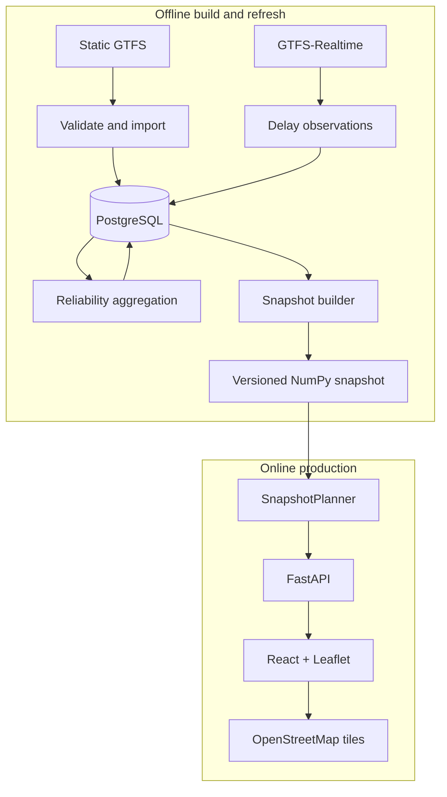

# Architecture

## System boundary

The project has two operational phases: an offline data pipeline and an online
snapshot service. PostgreSQL belongs to the pipeline. It is not part of the
production request path.

## Production request path

FastAPI loads one `RoutingSnapshot` during application startup. Stop lookup and
routing read memory-mapped arrays from that artifact. `SnapshotPlanner` executes
the public `astar` and `dijkstra` choices and serializes the shared routing-domain
models into API responses.

`/health` returns `200` while the process is alive. `/ready` returns `200` only
when the planner can route with a compatible, unexpired snapshot. Render uses
`/ready` as its health-check path.

## Snapshot format and compatibility

The current writer emits format version 3. The loader accepts formats 2 and 3.
Version 3 includes indexed transfer metadata and validated geographic-heuristic
metadata. A format-2 snapshot can still route; unavailable optional metadata
falls back to compatible behavior such as a zero heuristic.

The snapshot stores:

- Stop identifiers, names, codes, coordinates, and parent stations.
- Ordered transit connections and GTFS times as integer seconds.
- Service calendars and calendar-date exceptions.
- Transfers and version-3 stop-offset indexes.
- Exact and broader reliability profiles with sample counts.
- A manifest containing format, source, counts, build measurements, service
  range, and heuristic validation.

Unknown or corrupt formats fail clearly during loading. Expired service ranges
keep readiness false rather than producing empty route results.

## Frontend

The frontend uses React, TypeScript, Vite, Leaflet, and React Leaflet. It checks
`/ready`, submits the public route request schema, and renders each alternative
as a separate selectable map path. OpenStreetMap provides runtime tiles. Google
Fonts are optional; CSS fallback fonts preserve readable rendering when the font
request fails.

## Production versus experimentation

Production is deliberately narrow: `SnapshotPlanner`, `astar`, and `dijkstra`.
The database router, baseline model, MC-RAPTOR, experimental A*, request caches,
shared bounded caches, response caching, warm-up coordination, and benchmark
adapters remain available for development comparison. They are not silently
exposed through the production request schema.

## Repository boundaries

- `src/api`: HTTP lifecycle, validation, errors, and serialization.
- `src/routing`: production and experimental planners, domain models, caches,
  snapshot storage, and search.
- `src/reliability`: observation parsing, aggregation, profiles, and ranking.
- `src/data_ingestion`: static-feed validation and transactional loading.
- `scripts`: reproducible build, validation, download, and benchmark commands.
- `frontend`: user interface and browser-facing API client.
